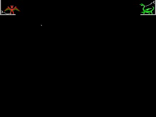

# u4intro

Simulating the [Ultima IV intro](https://www.youtube.com/watch?v=16pspR74M6w)
with [PyGame](https://www.pygame.org/).

Ever since I played *Ultima IV: Quest of the Avatar* on my C=64 I've been
fascinated with the cool graphics in the intro. Here's an attempt to
reproduce them using PyGame.

You can get Ultima IV for free from
[GOG.com](https://www.gog.com/game/ultima_4); this expects to find it installed
in `D:\Games\GOG\Ultima 4` (see `U4INTRO` in the code). Specifically it's
looking for `TITLE.EXE`, the DOS version of the intro, which is going to
provide some data.

Special thanks to
[Ultima Codex](https://wiki.ultimacodex.com/wiki/Ultima_IV_internal_formats#TITLE.EXE)
for their reverse engineering docs and the `Ultima4_LZW_Animate.png` file that
I use for the Daemon and Dragon animation frames (cheating a bit because I
don't want to decode the data from the original files).

The code also uses [pygame_recorder](https://github.com/tdrmk/pygame_recorder)
for saving the screen frames as an AVI file, which I've been converting into
GIF for posting online.

## TODO

* Make the Daemon and Dragon scroll down from the top.
* Add ULTIMA logo fade-in.
